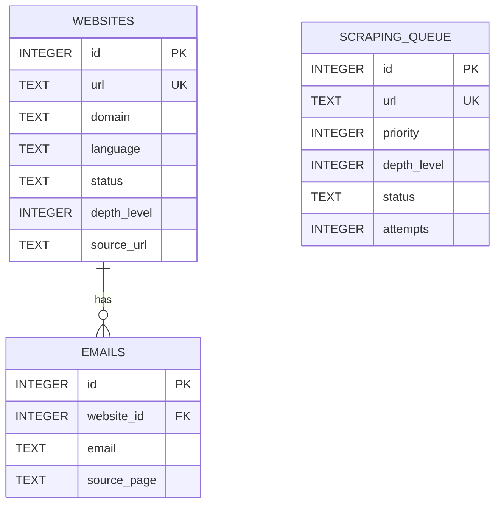

# Plan Técnico Definitivo: Sistema de Generación de Leads

## 1. Resumen Ejecutivo

Este documento presenta la arquitectura técnica definitiva para el software de generación de leads. El diseño se basa en un modelo **Cliente-Servidor desacoplado** para garantizar robustez, escalabilidad y una experiencia de usuario fluida.

El sistema se compone de dos partes principales:
-   **Backend (Servidor):** Un servicio sin interfaz gráfica que gestiona toda la lógica de negocio, el web scraping con Scrapy, la base de datos SQLite y expone una API REST para su control.
-   **Frontend (Cliente):** Una aplicación de escritorio con Tkinter que actúa como un panel de control, interactuando con el backend a través de la API REST.

Este enfoque resuelve los problemas de bloqueo de la interfaz y la complejidad de la concurrencia inherentes a una arquitectura monolítica.

## 2. Arquitectura del Sistema

### 2.1. Diagrama de Arquitectura

```mermaid
graph TD
    subgraph Frontend (Cliente)
        A[GUI - Tkinter]
    end

    subgraph Backend (Servidor)
        B[API REST - Flask/FastAPI]
        C[Motor de Scraping - Scrapy]
        D[Base de Datos - SQLite]
        E[Gestor de Colas]
    end

    A -- Peticiones HTTP --> B
    B -- Controla --> C
    B -- Consulta/Actualiza --> D
    C -- Lee/Escribe --> E
    C -- Almacena datos --> D
    E -- Almacena URLs --> D
```

### 2.2. Flujo de Datos

1.  El **Usuario** interactúa con la **GUI (Tkinter)** para configurar e iniciar un trabajo de scraping.
2.  La **GUI** envía una petición a la **API REST** del backend (ej. `POST /api/jobs`).
3.  La **API REST** valida la petición, crea un nuevo trabajo en la base de datos y lo pasa al **Gestor de Colas**.
4.  El **Motor de Scraping (Scrapy)**, que corre en un proceso separado, toma las URLs de la cola.
5.  **Scrapy** procesa las páginas, extrae leads y nuevos enlaces, y almacena los resultados directamente en la **Base de Datos (SQLite)**.
6.  La **GUI** consulta periódicamente la **API REST** (ej. `GET /api/stats`) para actualizar las estadísticas y los resultados en tiempo real sin bloquearse.

## 3. Estructura del Proyecto

La estructura de directorios y archivos se organizará de la siguiente manera para mantener una clara separación de responsabilidades:

```
leads-generator/
├── .venv/                     # Entorno virtual de Python
├── backend/                   # Lógica del servidor y scraping
│   ├── app/
│   │   ├── __init__.py
│   │   ├── api/               # Módulos de la API REST
│   │   │   ├── __init__.py
│   │   │   ├── jobs.py        # Endpoints para trabajos (iniciar, detener)
│   │   │   └── stats.py       # Endpoints para estadísticas
│   │   ├── core/              # Lógica de negocio principal
│   │   │   ├── __init__.py
│   │   │   └── config.py      # Configuración (rutas, etc.)
│   │   ├── database/          # Gestión de la base de datos
│   │   │   ├── __init__.py
│   │   │   ├── models.py      # Modelos de datos (SQLAlchemy/Peewee)
│   │   │   └── database.py    # Conexión y sesión
│   │   └── scraper/           # Proyecto Scrapy
│   │       ├── __init__.py
│   │       ├── spiders/
│   │       │   └── lead_spider.py # La araña principal
│   │       ├── items.py
│   │       ├── middlewares.py
│   │       ├── pipelines.py
│   │       └── settings.py
│   ├── run_backend.py         # Script para iniciar el servidor API
│   └── requirements.txt       # Dependencias del backend
│
├── frontend/                  # Aplicación de escritorio Tkinter
│   ├── app/
│   │   ├── __init__.py
│   │   ├── api_client.py      # Cliente para la API del backend
│   │   ├── views/             # Componentes de la GUI
│   │   │   ├── __init__.py
│   │   │   ├── main_window.py
│   │   │   └── widgets.py
│   │   └── main.py            # Lógica principal de la GUI
│   ├── run_frontend.py        # Script para iniciar la GUI
│   └── requirements.txt       # Dependencias del frontend
│
├── docs/
│   ├── architecture.md        # Boceto inicial (archivado)
│   └── technical_plan.md      # Este documento
│
└── .gitignore
```

## 4. Interfaz de Comunicación (API REST)

La API REST será el puente entre el frontend y el backend. Se implementará con **FastAPI** por su rendimiento y validación de datos automática.

**Base URL:** `http://127.0.0.1:8000/api/v1`

### 4.1. Endpoints de Trabajos (`/jobs`)

#### `POST /jobs`
-   **Descripción:** Inicia un nuevo trabajo de scraping.
-   **Request Body:**
    ```json
    {
        "start_url": "https://example.com",
        "config": {
            "depth": 3,
            "languages": ["es", "en"],
            "delay": 2
        }
    }
    ```
-   **Response (202 Accepted):**
    ```json
    {
        "job_id": "uuid-1234-abcd",
        "status": "starting",
        "message": "Scraping job started."
    }
    ```

#### `GET /jobs/{job_id}`
-   **Descripción:** Obtiene el estado de un trabajo específico.
-   **Response (200 OK):**
    ```json
    {
        "job_id": "uuid-1234-abcd",
        "status": "running",
        "start_time": "2023-10-27T10:00:00Z",
        "stats": {
            "processed_urls": 50,
            "queue_size": 200,
            "leads_found": 10
        }
    }
    ```

#### `DELETE /jobs/{job_id}`
-   **Descripción:** Detiene (cancela) un trabajo en ejecución.
-   **Response (200 OK):**
    ```json
    {
        "job_id": "uuid-1234-abcd",
        "status": "stopping",
        "message": "Scraping job is being stopped."
    }
    ```

### 4.2. Endpoints de Resultados (`/leads`)

#### `GET /leads`
-   **Descripción:** Obtiene la lista de leads encontrados, con paginación y filtros.
-   **Query Parameters:** `?page=1&limit=50&language=es&domain=example.com`
-   **Response (200 OK):**
    ```json
    {
        "pagination": {
            "total_items": 89,
            "total_pages": 2,
            "current_page": 1
        },
        "leads": [
            {
                "id": 1,
                "url": "https://lead1.com",
                "contact_email": "contact@lead1.com",
                "language": "es",
                "status": "processed",
                "source_url": "https://initial-site.com/page"
            }
        ]
    }
    ```

## 5. Diseño de la Base de Datos

Se utilizará **SQLite** a través de un ORM como **SQLAlchemy** para facilitar las consultas y la gestión de modelos.

### 5.1. Diagrama E-R



### 5.2. Definición de Tablas

**`websites`**
-   Almacena la información principal de cada sitio web único que se ha procesado o descubierto.
-   `id`: Clave primaria.
-   `url`: URL canónica del sitio.
-   `domain`: Dominio principal.
-   `language`: Idioma detectado.
-   `status`: Estado del procesamiento (`pending`, `processed`, `no_contact`, `failed`).
-   `depth_level`: Profundidad a la que se encontró.
-   `source_url`: De dónde se obtuvo este sitio.

**`emails`**
-   Almacena todos los correos electrónicos encontrados, vinculados a un sitio web.
-   `id`: Clave primaria.
-   `website_id`: Clave foránea a `websites.id`.
-   `email`: La dirección de correo electrónico encontrada.
-   `source_page`: La URL exacta donde se encontró el correo.

**`scraping_queue`**
-   Gestiona la cola de URLs por procesar.
-   `id`: Clave primaria.
-   `url`: La URL a scrapear.
-   `priority`: Prioridad del trabajo (menor número = mayor prioridad).
-   `depth_level`: Profundidad actual en el scraping encadenado.
-   `status`: `pending`, `processing`, `completed`, `failed`.
-   `attempts`: Número de reintentos.

## 6. Flujo de Trabajo y Especificaciones de Componentes

### 6.1. Backend

El backend es el cerebro del sistema. Se ejecutará como un proceso de servidor persistente.

#### Responsabilidades:
-   **Servidor API (FastAPI):**
    -   Exponer los endpoints definidos en la sección 4.
    -   Validar los datos de entrada (payloads, parámetros).
    -   Gestionar la autenticación si se añade en el futuro.
    -   Iniciar y detener los procesos de Scrapy de forma segura.
-   **Motor de Scraping (Scrapy):**
    -   Se ejecutará en un proceso separado, invocado por el servidor API.
    -   La araña (`lead_spider.py`) recibirá una URL inicial y una configuración.
    -   **Pipelines (`pipelines.py`):**
        1.  **DupeFilterPipeline:** Evitará procesar URLs duplicadas.
        2.  **LanguageFilterPipeline:** Descartará páginas que no coincidan con los idiomas seleccionados.
        3.  **DatabasePipeline:** Guardará los items (leads, emails) en la base de datos SQLite de forma asíncrona para no bloquear el scraper.
    -   **Middlewares (`middlewares.py`):**
        1.  **UserAgentRotationMiddleware:** Rotará user-agents para evitar bloqueos.
        2.  **RateLimitingMiddleware:** Ajustará dinámicamente la velocidad de scraping.
-   **Base de Datos (SQLAlchemy + SQLite):**
    -   Proporcionará una capa de abstracción sobre la base de datos.
    -   Los modelos (`models.py`) definirán la estructura de las tablas.
    -   Se encargará de las migraciones de la base de datos si el esquema cambia.

### 6.2. Frontend

El frontend es la cara visible del sistema, un cliente de la API del backend.

#### Responsabilidades:
-   **Interfaz de Usuario (Tkinter):**
    -   Implementará el diseño visual propuesto en el boceto inicial (panel de configuración, monitoreo y resultados).
    -   La ventana principal (`main_window.py`) organizará los paneles.
    -   Los widgets reutilizables (`widgets.py`) encapsularán elementos comunes.
-   **Cliente API (`api_client.py`):**
    -   Contendrá toda la lógica para comunicarse con el backend.
    -   Tendrá métodos como `start_job(config)`, `get_stats()`, `get_leads(page)`.
    -   Manejará los errores de red y las respuestas de la API.
    -   Las llamadas a la API se realizarán en **hilos separados** para no congelar la GUI.
-   **Gestión de Estado (`main.py`):**
    -   Orquestará la lógica de la aplicación cliente.
    -   Iniciará un bucle periódico (usando `root.after()`) para llamar a `api_client.get_stats()` y `api_client.get_leads()` y actualizar la vista.
    -   Gestionará la configuración introducida por el usuario y la pasará al cliente API.

## 7. Plan de Implementación y Fases

El desarrollo se dividirá en fases, priorizando la funcionalidad del backend.

-   **Fase 1: Backend Core (2 semanas)**
    -   [ ] Estructura del proyecto backend.
    -   [ ] Modelos de DB y conexión.
    -   [ ] API endpoints básicos (iniciar job, obtener leads).
    -   [ ] Scraper simple para una sola URL.
-   **Fase 2: Frontend Básico y Conexión (2 semanas)**
    -   [ ] Estructura del proyecto frontend.
    -   [ ] Ventana principal y panel de configuración.
    -   [ ] `api_client` para conectar con el backend.
    -   [ ] Funcionalidad para iniciar un job y ver los resultados en una tabla simple.
-   **Fase 3: Funcionalidad Avanzada de Scraping (3 semanas)**
    -   [ ] Scraping encadenado y gestión de profundidad.
    -   [ ] Pipelines de filtrado (idioma, duplicados).
    -   [ ] Middlewares de rotación de user-agent y rate-limiting.
-   **Fase 4: UI Avanzada y Pulido (2 semanas)**
    -   [ ] Panel de estadísticas en tiempo real.
    -   [ ] Paginación y filtros en la tabla de resultados.
    -   [ ] Empaquetado de la aplicación (PyInstaller).